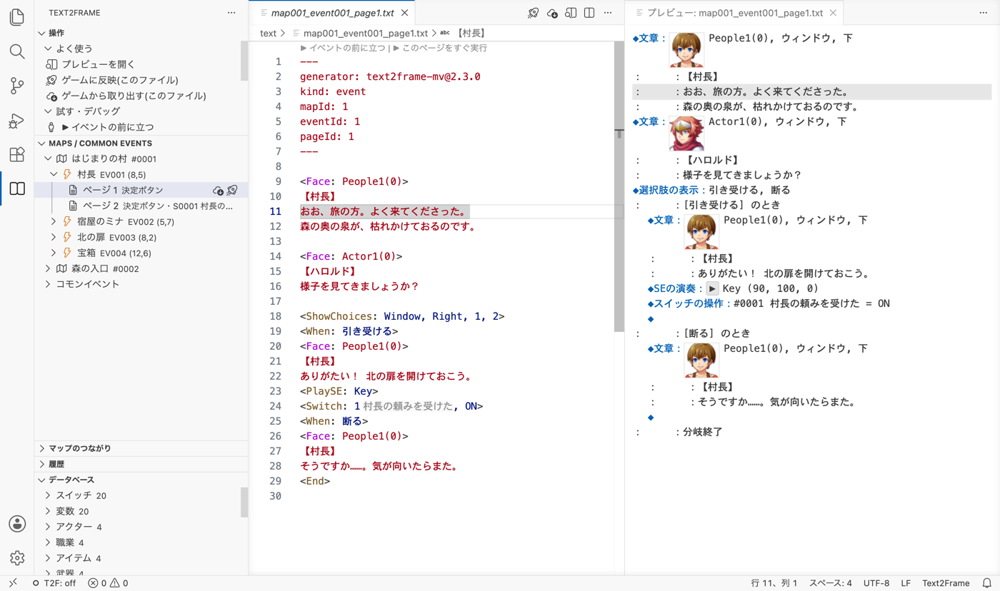
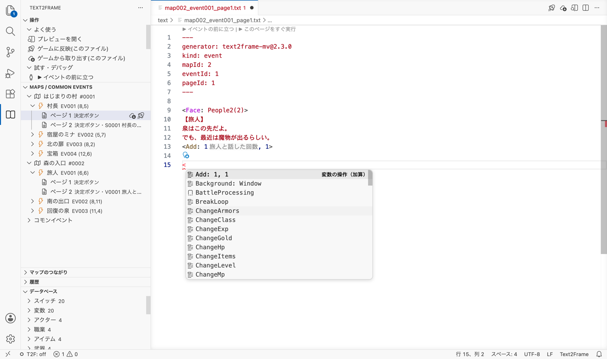
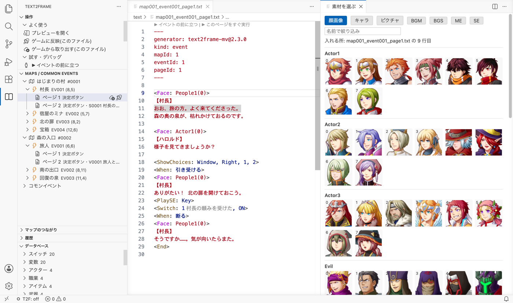
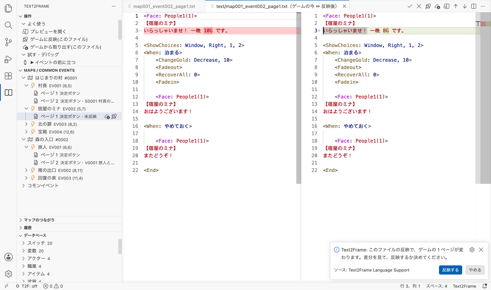
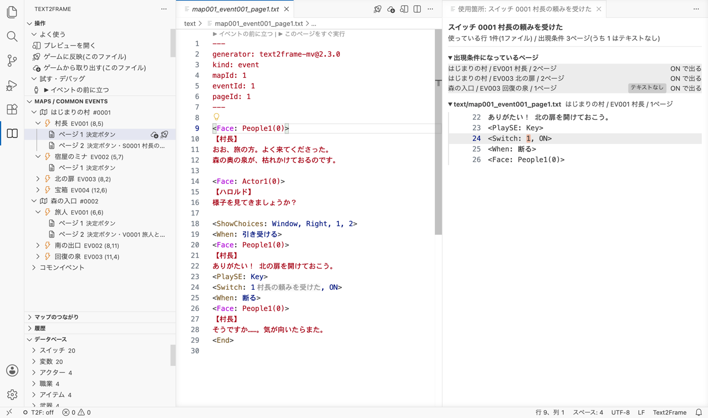
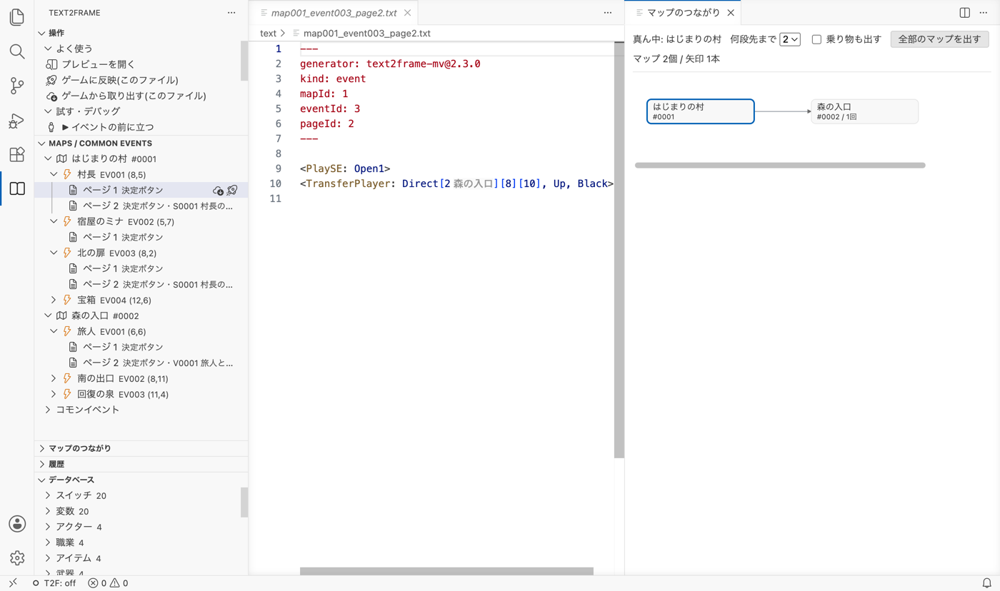
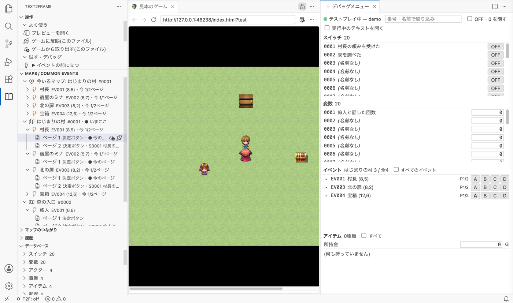

# Text2Frame Language Support

**RPG ツクール MV / MZ のイベントを、VS Code でテキストとして書き、見て、試すための拡張機能です。**

ツクールのイベント編集画面で1コマンドずつ入力する代わりに、セリフや選択肢をふつうの文章のように書けます。
書いたものはツクールと同じ形で確かめられ、ボタンひとつでゲームに入れて、そのまま VS Code の中でテストプレイできます。



---

## できること

| | |
| --- | --- |
| ✏️ **書く** | タグの候補と説明、書き間違いの指摘、番号の横のデータベースの名前、顔画像・キャラ画像・ピクチャ・音を一覧から選んで入れる |
| 👀 **見る** | 書いたテキストを、ツクールのイベント編集画面と同じ形で横に並べて見る。顔画像も出て、BGM・効果音はその場で鳴らせる |
| 🔄 **ゲームとやりとりする** | ゲームのセリフをテキストに取り出し、書いたテキストをゲームに反映する。ツクールで直したところは消えない。書き込む前に変わる所を確かめられ、あとから前の状態にも戻せる |
| 🔍 **調べる** | マップ・イベント・コモンイベントの一覧、データベースの一覧、スイッチや変数を使っている所、イベントやマップのつながり、プロジェクト全体の検査 |
| ▶️ **試す** | VS Code の中でテストプレイ。スイッチ・変数・アイテムなどの今の値を見て書き換える。イベントの前に立つ・ページをすぐ実行する。印をつけた行で一時停止して1行ずつ進める |

---

## はじめかた

### 1. ゲームのフォルダを開く

VS Code のメニュー「ファイル」→「フォルダーを開く」で、ツクールのゲームのフォルダ（中に `data` フォルダがある所）を開きます。

### 2. ゲームのセリフをテキストに取り出す

左端の **Text2Frame のアイコン**（本のマーク）を押し、「操作」→「まとめて反映・取り出す」→ **「すべてゲームから取り出す」** を押します。
ゲームのフォルダに `text` フォルダができ、イベントのページ・コモンイベントごとにテキストがそろいます。

### 3. 書いて、プレビューで見る

`text` の中のファイルを開いて、セリフを書き換えます。エディタの右上の「プレビューを開く」で、ツクールと同じ形で確かめられます。

### 4. ゲームに反映して、テストプレイする

エディタの右上の「ゲームに反映(このファイル)」を押すと、変わる所が差分で出ます。「反映する」を押すとゲームに書き込まれます。
「操作」→「試す・デバッグ」→「テストプレイ」で、VS Code の中でゲームが始まります。

> ⚠️ **ツクールのエディタを開いたまま保存しないでください。**
> 反映したあとにツクールで確かめるときは、ツクールを保存せずに閉じて開き直します。開いたまま保存すると、反映した内容がツクール側の古い内容で上書きされます。

---

## 画面の見取り図

| 場所 | あるもの |
| --- | --- |
| **左端の Text2Frame のアイコン**（本のマーク） | 5つの欄が並びます。<br>・**操作**: できることがボタンで並んでいます。迷ったらここ。「よく使う」「試す・デバッグ」「書くのを助ける」「調べる」「まとめて反映・取り出す」「上級」に分かれています<br>・**Maps / Common Events**: マップ・イベント・ページ・コモンイベントの一覧<br>・**マップのつながり**: 場所移動で行き来できるマップ<br>・**履歴**: 反映・取り出しの前の中身。前の状態に戻せます<br>・**データベース**: スイッチ・変数・アイテムなどの一覧 |
| **エディタの右上** | テキストを開いているときに「ゲームに反映(このファイル)」「ゲームから取り出す(このファイル)」「プレビューを開く」のボタンが出ます |
| **テキストのいちばん上** | 「▶ イベントの前に立つ」「▶ このページをすぐ実行」（コモンイベントなら「▶ すぐ実行」）の小さなリンクが出ます |
| **画面の左下** | `T2F: off` などの表示で、反映がうまくいったかが分かります |
| **画面の下のパネル** | 「Text2Frame デバッグプレイ」に、テストプレイ中のスイッチと変数が出ます |

ほとんどの操作は、コマンドパレット（`Ctrl+Shift+P` / `Cmd+Shift+P`）で `Text2Frame` と打っても呼び出せます。

---

## テキストを書く

### 書き方

ゲームから取り出したテキストは、次のような形です。

```text2frame
---
kind: event
mapId: 1
eventId: 1
pageId: 1
---

<Face: People1(0)>
【村長】
おお、旅の方。よく来てくださった。

<ShowChoices: Window, Right, 1, 2>
<When: 引き受ける>
ありがたい！
<Switch: 1, ON>
<When: 断る>
そうですか……。
<End>
```

- いちばん上の `---` で囲まれた部分は **宛先のメモ** です。このテキストをゲームのどこに戻すかが書いてあります（`kind: event` はマップのイベント、`kind: common` はコモンイベント）。**書き換えないでください。** 別のイベントに書き込まれてしまいます。
- `<Face: …>` のような `< >` で囲まれた行が **タグ** です。タグ1つが、イベントコマンド1つになります。
- **空行** で、メッセージウィンドウが次に切り替わります。同じウィンドウの中で空行を入れたいときは `<br>` と書きます。
- 行の頭に `%` を書くと、その行はゲームに入りません。メモに使えます。
- 顔・ウィンドウの背景・位置がいつもと同じなら、タグを書かなくてかまいません。反映のときに既定の値が入ります。
- 自分で新しく作るときは、`.t2f` か `.text2frame` の拡張子にするか、宛先のメモを先頭に書いた `.txt` にします。

### 書くのを助ける機能



| 機能 | どう働くか |
| --- | --- |
| タグの候補 | `<` を打つと、タグの候補が説明つきで出ます |
| タグの説明 | タグにマウスを合わせると、意味と使用例が出ます |
| データベースの名前 | `<Switch: 1, ON>` の `1` の横に、スイッチ1の名前が薄く出ます（ファイルには書き込みません）。マウスを合わせると詳しく出て、データベースに無い番号には印が付きます |
| 名前から番号を入れる | 番号を書く所で候補を出すと、名前で探して番号を入れられます |
| 書き間違いの指摘 | `< >` の閉じ忘れ、空のタグ、タグとして読まれずにゲームにそのまま文字で出てしまう行に、波線が付きます |
| メッセージのはみ出し | ウィンドウの幅を超える行に波線が付きます（顔グラフィックがあるときは、そのぶん狭く数えます）。自動で改行するプラグインが有効なプロジェクトでは調べません |
| 色見本 | 画面の色調変更・フラッシュなど、色を指定するタグの横に色見本が出ます |

### 画像・音を一覧から選ぶ



入れたい行にカーソルを置き、エディタで右クリック →「Text2Frame: 画像を選ぶ(顔・キャラ・ピクチャ)」または「Text2Frame: 音を選ぶ」を押すと、「**素材を選ぶ**」のタブが開きます。

- 上のタブで「顔画像」「キャラ」「ピクチャ」「BGM」「BGS」「ME」「SE」を切り替えます。「名前で絞り込み」で探せます。
- 絵を押すと、カーソルの行に `<Face: 名前(番号)>`・`<ChangeImage: 名前, 番号>`・`<ShowPicture: 1, 名前>` が入ります。行にもう同じ種類のタグがあれば、中身を置き換えます（ピクチャは名前だけを置き換え、番号や位置はそのまま）。
- 音は ▶ で試し聞きでき、「入れる」で `<PlayBGM: 名前, 90, 100, 0>` などが入ります。
- `<Face:` `<ChangeImage:` `<ShowPicture:` の候補のいちばん上の「一覧から見て選ぶ…」や、そのタグの行の電球からも開けます。

### 電球で直す

波線の所にカーソルを置くと出る電球（`Ctrl+.` / `Cmd+.`）から、直し方を選べます。

| 波線が付くもの | 選べる直し方 |
| --- | --- |
| タグの名前の打ち間違い（例: `<Fase: …>`） | 「「<Face」に直す」など、近いタグの名前 |
| タグの閉じ忘れ | 「行の終わりに「>」を足す」 |
| 空のタグ `<>` | 「空のタグ「<>」を消す」 |
| データベースに無い番号 | 「候補から選び直す」 |
| メッセージのはみ出し | 「ここで改行する」 |
| 衝突の目印（[両方で変えていたとき](#両方で変えていたとき競合)） | 「テキストの方を残す」「ゲームの方を残す」「両方残して、目印だけ消す」 |

### スニペット（よく使う書き方の型）

- **行の頭で `/` を打つ** と、選択肢・条件分岐・顔付きのセリフ・場所移動などの型が候補に出ます。選ぶと、書き換える所にカーソルが入り、`Tab` で次へ移ります。
- 「操作」→「書くのを助ける」→「スニペットを入れる」からも一覧で選べます。
- **自分で作る**: よく使う部分を選んで、右クリック →「Text2Frame: 選んだ部分をスニペットにする」。呼び出す言葉を決めると、行の頭で `/言葉` と打つと出るようになります。作ったものは、ゲームのフォルダの `.vscode/text2frame-snippets.json` に入ります（「スニペットを編集する」で開けます）。

### テキストの中を行き来する

| 操作 | できること |
| --- | --- |
| 定義へ移動（`F12`、`Ctrl`/`Cmd` を押しながらクリック） | `<CommonEvent: 1>` からそのコモンイベントのテキストへ、`<JumpToLabel: …>` からそのラベルへ、スイッチ・変数の番号から値を変えている所へ、場所移動のマップ番号からそのマップのテキストへ |
| 参照の一覧（`Shift+F12`） | そのスイッチ・変数・コモンイベントなどを使っている所を、プロジェクト全体から一覧にします |
| 名前で開く（`Ctrl+T` / `Cmd+T`） | マップ名・イベント名・コモンイベント名の一部を打って、そのテキストを開きます |
| アウトライン・折りたたみ | 選択肢・条件分岐・ラベル・メッセージが入れ子で並び、畳めます |

---

## プレビューで見る

エディタの右上の「**プレビューを開く**」で、書いたテキストをツクールのイベント編集画面と同じ形（`◆文章：`・`◆選択肢の表示：` など）で横に並べます。

- 「文章の表示」には顔画像が出て、番号にはデータベースの名前が添えられます。
- 開いているテキストに付いていきます。書き換えると、少し間を置いて描き直されます。
- エディタのカーソルの行が、プレビューでも強調されます。**プレビューの行を押すと、テキストのその行へ飛びます。**
- BGM・BGS・ME・効果音の行の ▶ を押すと、その場で鳴ります。

---

## ゲームとやりとりする（取り出す・反映）

### 取り出す・反映する

- **ゲームから取り出す**: ゲームの中身をテキストに入れます。**あなたが書いたところは残り**、ツクールで変わったところだけが入ります。
- **ゲームに反映**: テキストの中身をゲームに入れます。**ツクールで直したところは残り**、テキストで変えたところだけが入ります。

| 対象 | 押す場所 |
| --- | --- |
| 開いているテキスト | エディタの右上、または「操作」→「よく使う」の「ゲームに反映(このファイル)」「ゲームから取り出す(このファイル)」 |
| テキストのフォルダ全部 | 「操作」→「まとめて反映・取り出す」の「すべてゲームに反映」「すべてゲームから取り出す」 |
| 一覧の中の1ページ | 「Maps / Common Events」一覧のページの行にマウスを合わせると出る「ゲームに反映」「ゲームから取り出す」のボタン |

- 反映しても変わらないテキスト、取り出しても変わらないテキストは書き込みません。
- 書き方が間違っているときは、ゲームに書き込まずに止まります。
- 「すべて」は、テキストが多いと少し時間がかかります。進み具合が右下に出て、途中でやめられます。
- 「会話のみ書き出し」（「操作」→「まとめて反映・取り出す」）は、セリフだけを `*.conversation.txt` に書き出します。

### 書き込む前に、変わる所を確かめる



ボタンで反映・取り出しをすると、すぐには書き込まず、**変わる所が差分の画面で開きます**。

- 反映は左が「ゲームの今」、右が「反映後」。取り出しは左が「今のテキスト」、右が「取り出し後」です。
- 右上の ✓ か、知らせの「反映する」（取り出しは「書き込む」）で書き込みます。✕ か「やめる」なら、何も書き込みません。
- 「すべて」のときは、変わるファイルが1つの画面にまとめて並びます。
- すぐ書き込みたいときは、設定 `text2frame.reviewBeforeApply` をオフにします。

### 反映・取り出しのあと、もう一方も合わせる

反映すると、ツクール側で変わっていたところがテキストにも入ります。取り出すと、テキストで書いたところがゲームにも入ります。どちらも、終わったときにテキストとゲームの中身がそろいます。
そろえたくないときは、設定 `text2frame.writeBackAfterMerge` を `off`（競合しなかったときは相手側に書かない）にします。

### 両方で変えていたとき（競合）

同じ所をテキストとツクールの両方で別々に変えていたときは、どちらも消さずに、**操作を始めた側** に両方の版と **衝突の目印** を入れます。

| した操作 | 衝突の目印が入る所 | 直す場所 |
| --- | --- | --- |
| ゲームに反映 | テキスト | テキスト |
| ゲームから取り出す | ゲームのイベント | ツクール |

```
=== テキストの変更 / from text ===
（テキスト側の内容）
=== ゲームの変更 / from game ===
（ゲーム側の内容）
=== どちらかを残し、この目印3行を消す / keep one, delete these 3 marker lines ===
```

**直し方**: 残したい方だけにして衝突の目印を消し、もう一度同じ操作をします。テキストでは、目印の行の電球から「テキストの方を残す」「ゲームの方を残す」「両方残して、目印だけ消す」を選べます。
衝突の目印が残っているファイルは、反映も取り出しもされません。

### 保存するだけで反映する

「操作」→「まとめて反映・取り出す」→「保存時に自動反映 切替」をオンにすると、テキストを保存するたびにゲームへ反映します（確かめの画面は出ません）。
画面の左下の表示で、今の状態が分かります。

| 表示 | 意味 |
| --- | --- |
| `T2F: watching` | 保存したら自動で反映する |
| `T2F: off` | 自動では反映しない |
| `T2F ok` | 直前の反映がうまくいった |
| `T2F fail` | 直前の反映がうまくいかなかった（押すと理由が出ます） |

### 前の状態に戻す（履歴）

反映や取り出しでファイルを書き換える直前の中身を、自動で控えておきます。

- 「**履歴**」の欄（または「操作」→「上級」→「履歴(前の状態に戻す)」）に、操作が新しい順に並びます。開くと、書き換わったファイルが並び、押すと差分が出ます。
- 操作の行を右クリック →「**この操作の前に戻す**」で戻せます。ファイルの行からは「このファイルだけ戻す」もできます。戻したことも履歴に残るので、取り消せます。
- 控えはゲームのフォルダの `.t2f-history` に置きます。残すのは最新の100回ぶんです（設定 `text2frame.history.keep`）。消してもゲームの動きには関係しません。

---

## プロジェクトを調べる

### 「Maps / Common Events」一覧

マップ → イベント → ページ、コモンイベントが、ツクールのマップツリーと同じ並びで出ます。

- ページの行には、トリガーと出現条件が名前つきで出ます（例: `決定ボタン・S0001 村長の頼みを受けた が ON`）。
- ページを押すと、そのテキストが開きます。まだテキストが無ければ、ゲームから取り出すかを聞きます。
- ゲームに反映していない変更があるページには「**未反映**」と出ます。
- 右クリックで「イベントの前に立つ」「このページをすぐ実行」「つながりを見る」「マップのつながりを見る」「マップのつながりを図で見る」を選べます。
- **テストプレイ中は**、いちばん上に「**今いるマップ**」が出ます。イベントの行には、今出ているページが「今 1/2ページ」（全2ページのうち1ページ目）のように出ます。どのページも出ていないイベントは「出ていない」です。

### 「データベース」一覧と、使っている所の逆引き



スイッチ・変数・アクター・アイテムなどが、番号と名前で並びます。

- **スイッチや変数を押すと**、それを使っている所が、前後の行つきで一覧になります。行を押すと、そのテキストへ飛びます。
- 一覧のいちばん上には「**出現条件になっているページ**」も出ます（スイッチが ON で出るページ、変数が一定以上で出るページ、アイテムを持っていると出るページなど）。テキストの無いページには「**テキストなし**」の印が付きます。押すと、そのページのテキストを開きます。テキストが無いときは「このイベントにはテキストがありません」と知らせてから、ゲームのデータから読んだ中身を、読むだけの画面で開きます。
- スイッチ・変数以外を押すと、開いているテキストのカーソルの位置にその番号が入ります。
- 行の右の虫眼鏡（「使っている箇所を探す」）や右クリックからも選べます。

### イベントのつながりをたどる

「このイベントが何をして、その先で何が起きるか」を、VS Code の呼び出し階層でたどれます。
テキストの上で右クリック →「呼び出し階層を表示」（`Shift+Alt+H`）、または「操作」→「調べる」→「イベントのつながりを見る」で開きます。

- **ここから**: 呼ぶコモンイベント、場所移動の行き先、ON / OFF にするスイッチ、変える変数
- **ここへ**: このコモンイベントを呼んでいるページ、このマップへ移動させているページ
- スイッチの行を開くと、そのスイッチが ON になると出てくるページや、動き出すコモンイベントが並びます。何段でもたどれます。
- テキストの無いページには「テキストなし」と出ます。

### マップのつながり



場所移動で、どのマップからどのマップへ行けるかが分かります。

- 「**マップのつながり**」の欄: 今開いているテキストのマップ（テストプレイ中は、ゲームが今いるマップ）の「行き先のマップ」と「ここへ来るマップ」が並びます。押すと、その移動の行へ飛びます。
- 「操作」→「調べる」→「**マップのつながりを図で見る**」: 丸と矢印の図がタブで開きます。丸を押すとそのマップが真ん中に、矢印を押すと移動の行へ飛びます。「何段先まで」「乗り物も出す」「全部のマップを出す」で出し方を変えられます。

### プロジェクト全体を検査する

「操作」→「調べる」→「**プロジェクト全体を検査**」で、全部のテキストを調べて、見つかった問題を VS Code の「問題」パネルに出します。

- 書き間違い（閉じ忘れ・空のタグ・タグとして読まれない行・コンパイルできない所）
- データベースに無い番号、無い顔画像、無い音声
- 残っている衝突の目印、メッセージのはみ出し
- 宛先のメモが指す場所がゲームに無いもの、ゲームに反映していない変更があるもの

---

## テストプレイとデバッグ

### 始める・止める

- 「操作」→「試す・デバッグ」→「**テストプレイ**」で、VS Code の中のタブでゲームが始まります（ツクールのテストプレイと同じテストモードです）。反映した内容は、ゲームのタブを読み直すと効きます。
- 「テストプレイを止める」で止めます。いつものブラウザで遊びたいときは、コマンドパレットの「Text2Frame: テストプレイ(外のブラウザで)」を使います。

### デバッグメニュー



「操作」→「試す・デバッグ」→「**デバッグメニューを表示**」で、テストプレイ中の値がタブに並びます（画面の下のパネル「Text2Frame デバッグプレイ」にも同じものが出ます）。

| 欄 | 見られるもの | できること |
| --- | --- | --- |
| スイッチ | すべてのスイッチの ON / OFF | 押して切り替える |
| 変数 | すべての変数の値 | 値を打って Enter で書き換える |
| イベント | 今いるマップのイベント。今出ているページ（`P1/2` は全2ページのうち1ページ目）と、セルフスイッチ A〜D | セルフスイッチを押して切り替える。イベント名を押すと、そのテキストとプレビューが開く |
| アイテム | 所持金と、持っているアイテム・武器・防具の数 | 数を打って Enter で書き換える |

- イベントの左の ▸ を押すと、ページごとの出現条件とトリガーが、今の値で満たしているか（✓ / ✗）つきで出ます。「なぜ今このページなのか」が分かります。
- 「番号・名前で絞り込み」で探せます。「OFF・0 を隠す」で、ON のスイッチや 0 でない値だけになります。
- 「実行中のテキストを開く」にチェックを入れると、ゲームで動いているイベントのテキストが自動で開きます。

### このイベントから試す

テキストのいちばん上のリンクや、「操作」→「試す・デバッグ」から、そのイベントをすぐ試せます。最初から歩いていく必要はありません。

| リンク | 何をするか |
| --- | --- |
| ▶ イベントの前に立つ | そのマップへ移動して、イベントの隣に立ちます。話しかける・触れるのは自分で行うので、出現条件やトリガーもゲームのとおりに試せます |
| ▶ このページをすぐ実行 | そのマップへ移動して、このページの中身をすぐ動かします（出現条件は見ません） |
| ▶ すぐ実行 | コモンイベントを、今いる所ですぐ動かします |

- テストプレイが動いていなければ始め、タイトル画面なら新しいゲームを始めます。
- プレイヤーが透明でも、見えるようにしてから始めます（「このページをすぐ実行」でそうしたくないときは、設定 `text2frame.tryEvent.clearPlayerTransparency` をオフにします）。
- テキストにゲームへ反映していない変更があれば、「反映して試す」か「このまま試す」かを聞きます。

### 今動いている行を見る

テストプレイ中にイベントが動くと、そのテキストの **動いている行に色が付きます**。画面の左下にもイベント名と行が出て、押すとその行が開きます。

### 印をつけた行で一時停止する

「この行まで来たらゲームを止めて、値を見たい」ときに使います。

1. テキストの行番号の左をクリックして、赤い丸の印を付けます。
2. 「操作」→「上級」→「**印をつけた行で一時停止する**」を押して、オンにします（名前の横に「オン」と出ます）。
3. テストプレイ・「▶ このページをすぐ実行」・「▶ イベントの前に立つ」のどれで始めても、その行まで来るとゲームが止まります。

止まると、ゲームの画面の上に「一時停止中」の帯が出て、VS Code の右下に「一時停止しました: （ファイル名）の（行）行目」と出ます。「**続ける**」で先へ進み、「**印をすべて消して続ける**」で印を全部消して進みます。

- 止まっている間は、左の「実行とデバッグ」の欄で、スイッチ・変数・このイベントのセルフスイッチ・所持金とアイテムを見たり書き換えたりできます。ウォッチには `S12`（スイッチ12）・`V5`（変数5）のように書きます。
- 画面の上のボタンで、1行ずつ進める（`F10`）、コモンイベントの中に入る（`F11`）、次の印まで進める（`F5`）ことができます。
- **オフのとき（最初はオフ）は、印があってもゲームは止まりません。**

---

## 多言語版を作る

言語ごとにテキストのフォルダを分けて使います。

1. 設定 `text2frame.textBaseDir` を `text-en` などに変えて、「すべてゲームから取り出す」を押します。翻訳の出発点になるテキストがそろいます。
2. `text-en` のセリフと選択肢を訳します（宛先のメモとタグはそのまま）。
3. 「すべてゲームに反映」を押します。ツクールで直したところは残ったまま、訳文が入ります。

元の言語に戻すときは、`text2frame.textBaseDir` を `text` に戻します。

---

## 設定

VS Code の設定（`Ctrl+,` / `Cmd+,`）で `text2frame` と検索すると出てきます。**ふだんはそのままで大丈夫です。**

| 設定 | 既定 | 決めること |
| --- | --- | --- |
| `text2frame.strategy` | `merge` | ゲームへの反映のしかた。`merge` は安全に統合（ゲーム側の編集を勝手に消さない）、`overwrite` はテキストで全部上書き（ゲーム側の編集は消えます） |
| `text2frame.reviewBeforeApply` | オン | ボタンで反映・取り出すとき、変わる所を差分で見せてから書き込む |
| `text2frame.writeBackAfterMerge` | `always` | 反映・取り出しのあと、もう一方にも結果を書く。`off` は競合しなかったときは相手側に書かない |
| `text2frame.englishTag` | オン | 取り出すとき、タグを英語（`<Face: >`）で書く。オフなら日本語（`<顔: >`） |
| `text2frame.omitDefaultTags` | オン | 取り出すとき、既定と同じ顔・背景・位置のタグを書かない |
| `text2frame.showDatabaseNames` | オン | 番号の横に、データベースの名前を薄く出す |
| `text2frame.messageCheck` | `auto` | メッセージのはみ出しを調べるか。`auto` は自動で改行するプラグインが有効なら調べない、`on` はいつも、`off` は調べない |
| `text2frame.messageLineLength` | `0` | 顔の無いメッセージの1行の文字数（全角）。`0` なら自動 |
| `text2frame.history.keep` | `100` | 反映・取り出しの前の中身を、何回ぶん控えるか。`0` で控えない |
| `text2frame.usageContextLines` | `2` | 「使っている箇所」の一覧に、前後を何行ずつ出すか |
| `text2frame.tryEvent.clearPlayerTransparency` | オン | 「このページをすぐ実行」で、プレイヤーの透明化を解除してから始める |
| `text2frame.openRunningText` | オフ | テストプレイ中、動いているイベントのテキストを自動で開く |
| `text2frame.testPlayPage` | （空） | テストプレイで開くページ。空なら `index.html` |
| `text2frame.textBaseDir` | `text` | テキストを置くフォルダ |
| `text2frame.dataDir` | `data` | ゲームのデータのフォルダ |
| `text2frame.modulePath` | （空） | `Text2Frame.js` の場所。ふつうは空のままで自動で見つかります |

---

## 困ったとき

| こんなとき | どうする |
| --- | --- |
| 反映したのに、ツクールで見ると変わっていない | ツクールを保存せずに閉じて、開き直してください |
| 反映を押しても書き込まれない | 差分の画面が開いています。右上の ✓ か、知らせの「反映する」を押してください |
| 画面の左下が `T2F fail` になる | 書き方の間違いです。`T2F fail` を押すと理由が出ます |
| テキストに衝突の目印が入っている | 両方で同じ所を変えた印です。残したい方だけにして衝突の目印を消し、もう一度反映してください（[両方で変えていたとき](#両方で変えていたとき競合)） |
| 取り出したら、書いた文が消えた | 「上級」の「全部取り直す(上書き)」はテキストを全部上書きします。ふだんは「ゲームから取り出す」を使ってください。[履歴](#前の状態に戻す履歴)から戻せます |
| `.txt` に色が付かない | 先頭に宛先のメモ（`---` で囲んだ部分）があるファイルだけが対象です |
| 「ツクールのプロジェクト(data/System.json)が見つかりません」と出る | ゲームのフォルダ（`data` がある所）を開いてから、もう一度試してください |
| テストプレイが真っ黒・エラーになる | 設定 `text2frame.testPlayPage` に、ゲームのフォルダで最初に開くページを入れてみてください |
| テストプレイが止まったまま進まない | 「印をつけた行で一時停止する」がオンで、印の行に来たのかもしれません。知らせの「続ける」を押すか、「操作」→「上級」でオフにしてください |
| 画面の言葉が英語で出る | 下の「[表示の言語](#表示の言語)」を見てください |

---

## 表示の言語

画面の言葉は、VS Code の表示言語に合わせて日本語か英語で出ます。
日本語で出ないときは、拡張機能の画面で **Japanese Language Pack** を入れ、コマンドパレットの「Configure Display Language」で `ja` を選んで、VS Code を再起動してください。
タグの説明と、Text2Frame 本体が出す警告は、表示言語に関係なく日本語です。

## 動かすのに必要なもの

- VS Code 1.85.0 以上（Windows / Mac）
- RPG ツクール MV / MZ のプロジェクト

Node.js などを別に入れる必要はありません。テキストとゲームのデータの変換には、拡張に同梱した [Text2Frame](https://github.com/yktsr/Text2Frame-MV) を使います。

## ライセンス・リンク

- ライセンス: MIT
- [Text2Frame-MV（GitHub）](https://github.com/yktsr/Text2Frame-MV) — 不具合の報告や要望は [Issues](https://github.com/yktsr/Text2Frame-MV/issues) へ
